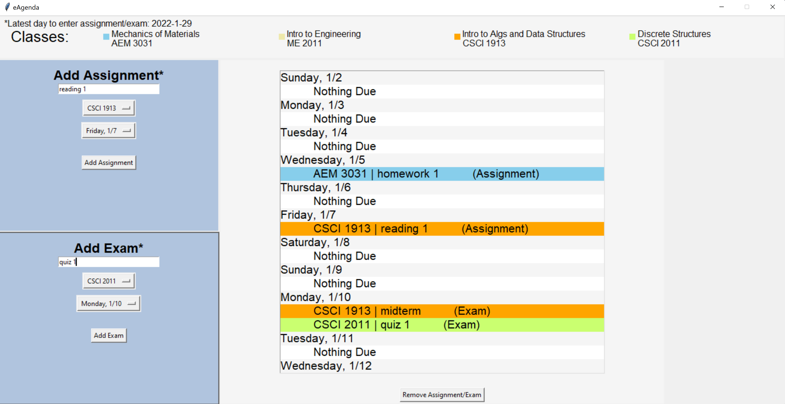

# eAgenda
eAgenda is a electronic agenda, aimed towards students, that can support up to 6 classes. The app is written in Python,
utilizing the Tkinter GUI framework. All data from the agenda is stored in a .txt file (eAgenda_data.txt) that must be in
the same directory as the main file (eAgenda.py) in order for the agenda to stay up to date between uses.

## User Interface

